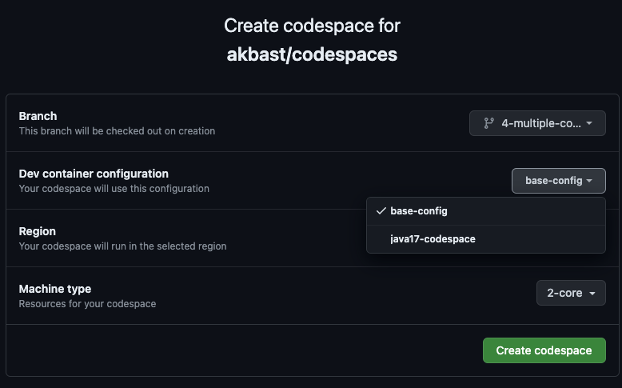
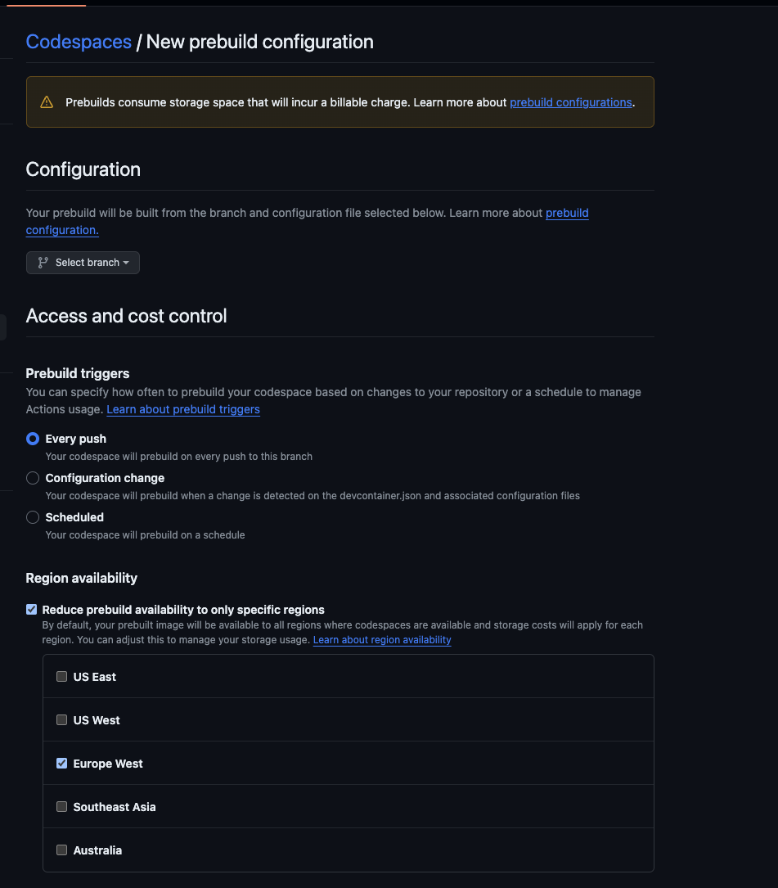
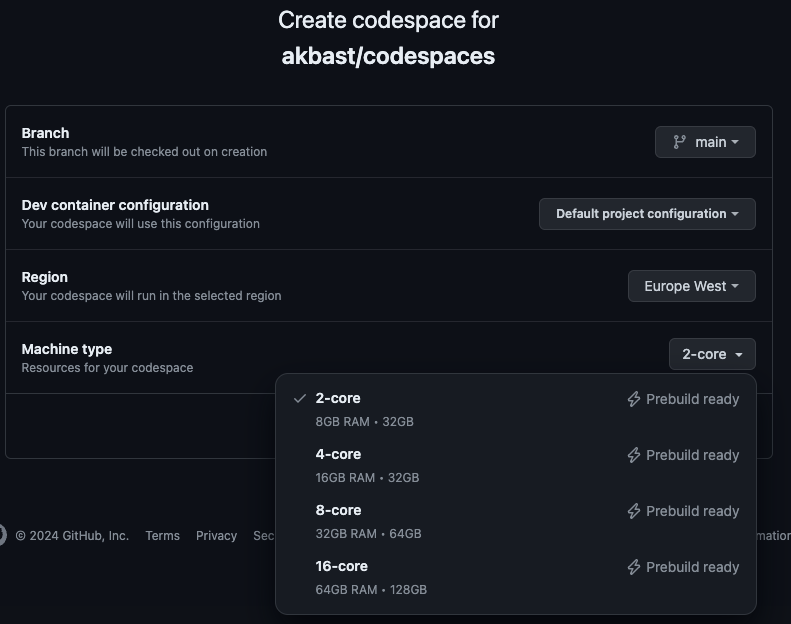

# codespaces

## What are codespaces?
- dev environment living in the cloud.
- configuration-as-code. 
- dev containers work local on the machine, codespaces run on remote hardware managed by gh.
- from 2 core machines up to 32 core.

## Configuration
- [base-configuration](https://github.com/akbast/codespaces/blob/main/.devcontainer/devcontainer.json#L2)
- [with-features](https://github.com/akbast/codespaces/blob/1-features/.devcontainer/devcontainer.json#L3-L18)
- [with-extensions](https://github.com/akbast/codespaces/blob/2-extensions/.devcontainer/devcontainer.json#L21-L25)
- [with-post-create-command](https://github.com/akbast/codespaces/blob/3-post-create-command/.devcontainer/devcontainer.json#L28)
- [multiple-configuration](https://github.com/akbast/codespaces/blob/4-multiple-configuration/.devcontainer/java17/devcontainer.json)

- [Docker Helps](https://github.com/akbast/codespaces/tree/5-docker-based/.devcontainer/docker-based)

## Prebuilds
- Solution for large images.
- Do not build on every codespace. Built once and used by whole team. 
- Builds can be scheduled, on every push or config change

## Secrets
- Define [necessary secrets](https://github.com/akbast/codespaces/blob/7-secrets/.devcontainer/devcontainer.json#L30-L36) for codespace to work.
- Codespace secrets to share with the team. 
- Secrets in user scope.

# Wrap up!
- It now works on every machine!!!
- Collaboration made easier.
- Easy onboarding for new members.
- Code even with an iPad.

- No connection no code!
- Hard to setup VPN bridge.
- Forgot to commit, gone forever!
